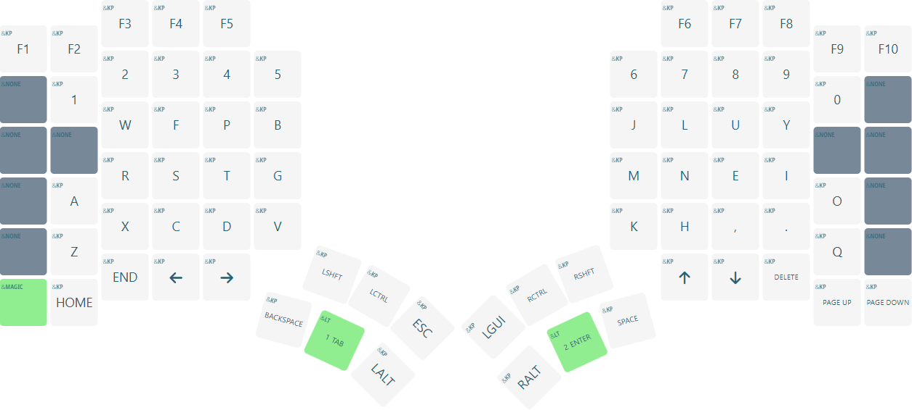
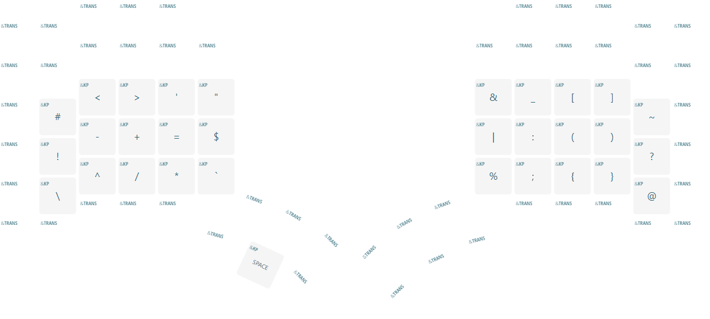
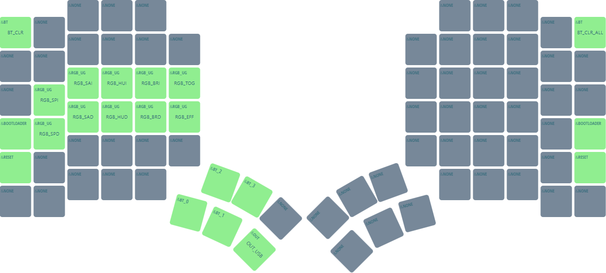

# Glove80 custom

## Notes

Most of the binds should be self explanatory, the goal of the mod-tap on enter (that sends right super + left alt) is to act as my window manager binding mod.

Using this combo over a regular super binding so I can use similar binds between Linux and mac, since mac heavily uses super (command) for regular bindings.

## DTSI fragment

```
&sk { quick-release; }; // Release sticky shift immediately on press to prevent rolling multiple caps
&lt { quick-tap-ms = <200>; }; // Allow double tapping layer taps to hold for repeats
```

## Layers

#### Base layer:



#### Number:


#### Symbol:



#### Magic:



#### Gaming:

*What is this layer about?* Steam games, at least on Linux, don't seem to like hold-tap keys at all. They either don't fire or do something strange. This layer removes them so I can use the thumb cluster for games. Also add Q in place of caps word, to give me an extra bind to use when I am only using the one half.


