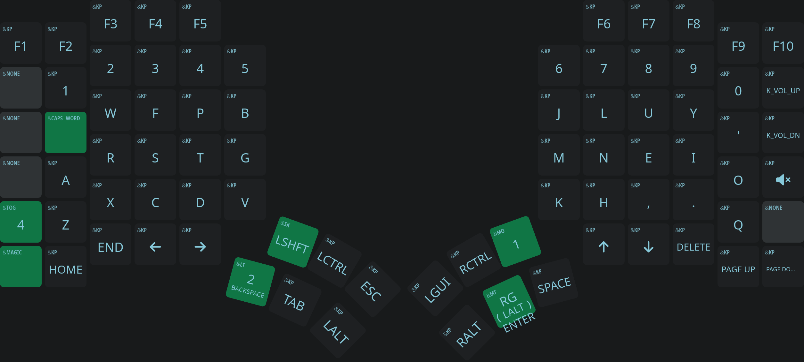
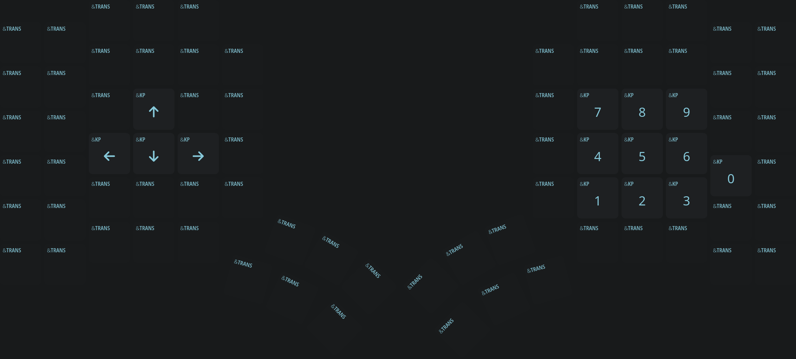
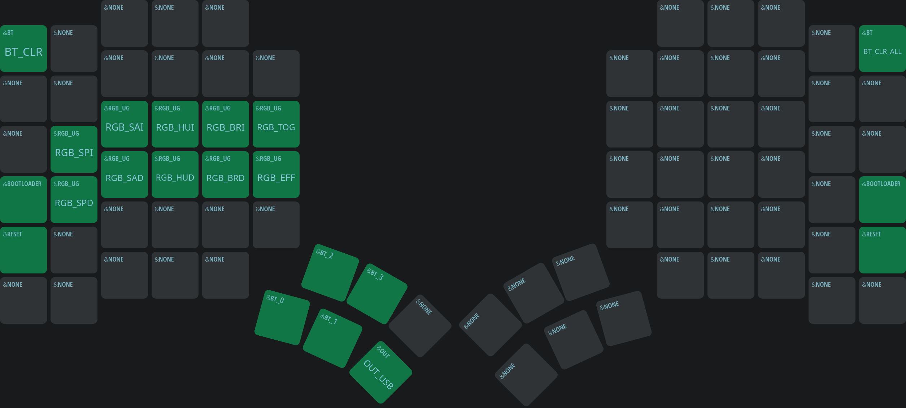

# Glove80 custom

## DTSI fragment

```
&sk { quick-release; }; // Release sticky shift immediately on press to prevent rolling multiple caps
&lt { quick-tap-ms = <200>; }; // Allow double tapping layer taps to hold for repeats
```

## Layers

#### Base layer:



#### Number:



#### Symbol:


#### Magic:



#### Gaming:

*What is this layer about?* Steam games, at least on linux, don't seem to like hold-tap keys at all. They either don't fire or do something strange. This layer removes them so I can use the thumb cluster for games. Also add Q in place of caps word, to give me an extra bind to use when I am only using the one half.


